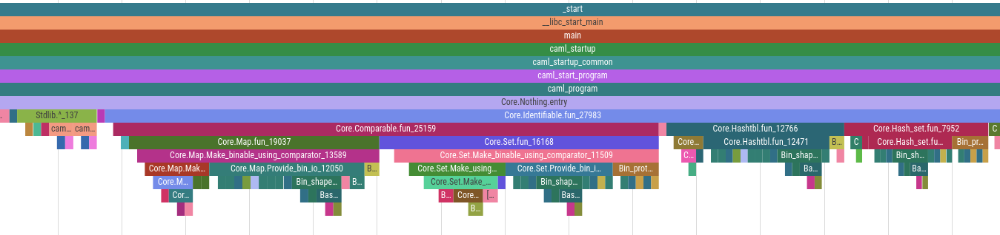

<h1 align="center">
  
   
  magic-trace
</h1>

  
  
  

Magic-trace uses Intel PT to tell you what just happened. You give it a function name. Then, it attaches to a running process and when that function is called it will show you everything that happened for ~10ms (varies, and is partially configurable) leading up to that function call.

There's also a lazy way to use this: attach it to a running process and detatch it with <kbd>Ctrl</kbd>+<kbd>C</kbd>, and see a random trace of your program. This is especially useful if your program is being slow and you don't know why.

Magic-trace traces *all control flow* in the snapshot, and that means you can get extremely low granularity data on what your program is doing. For example, here's 10us of an ocaml program's startup procedure, with timing resolution of around 40ns:

# Getting started

1. Make sure the system you want to trace is [supported](https://github.com/janestreet/magic-trace/wiki/Supported-platforms,-programming-languages,-and-runtimes). The constraints that most commonly trip people up are: VMs are mostly not supported, Intel only (Skylake or later), Linux only.

1. Grab a release binary from the [latest release page](https://github.com/janestreet/magic-trace/releases/latest).

   1. If downloading the prebuilt binary (not package), `chmod +x magic-trace`
   1. If downloading the package, run `sudo dpkg -i magic-trace*.deb`

   Then, test it by running `magic-trace -help`, which should bring up some help text.

1. [Here](https://raw.githubusercontent.com/janestreet/magic-trace/master/demo/demo.c)'s a sample C program to try out. It's a slightly modified version of the example in `man 3 dlopen`. Download that, build it with `gcc -gdwarf-4 -ldl demo.c -o demo`, then leave it running `./demo`.

1. Run `magic-trace attach -pid $(pidof demo) -output trace`. When you see the message that it's successfully attached, wait a couple seconds and <kbd>Ctrl</kbd>+<kbd>C</kbd> `magic-trace`. It will output a file called `trace` in your working directory.

1. Open [Perfetto](https://ui.perfetto.dev/), click "Open Trace File" in the top-left-hand and give it the trace file generated in the previous step.

1. Once it's loaded, expand the trace by clicking the two little arrows in the main trace area.

1. That should have expanded into a trace. Your screen should now look something like this:

1. Use <kbd>W</kbd><kbd>A</kbd><kbd>S</kbd><kbd>D</kbd> and the scroll wheel to navigate around. <kbd>W</kbd> zooms in (you'll need to zoom in a bunch to see anything useful), <kbd>S</kbd> zooms out, <kbd>A</kbd> moves left, <kbd>D</kbd> moves right, and scroll wheel moves your viewport up and down the stack. You'll only need to scroll to see particularly deep stack traces, it's probably not useful for this example. Zoom in until you can see an individual loop through dlopen/dlsym/cos/printf/dlclose.

1. Click and drag on the white space around the call stacks to measure. Plant flags by clicking in the timeline along the top. Using the measurement tool, measure how long it takes to run `cos`. On my screen it takes ~3us.

Congratulations, you just magically traced your first program!

The way magic-trace works is that it continuously records control flow into a ring buffer. Upon some sort of trigger, it takes a snapshot of that buffer and reconstructs call stacks.

There are two ways to take a snapshot:

You just did this one: <kbd>Ctrl</kbd>+<kbd>C</kbd> magic-trace. If magic trace terminates with already having taken a snapshot, it takes a snapshot.

You can also trigger snapshots when the application calls a function. You can either use the default stop indicator function, `magic_trace_stop_indicator`, or supply the `-symbol` flag to magic-trace to supply your own symbol. The function which triggers the snapshot doesn't need to do anything in particular, magic-trace just needs the name. Our official ocaml library's "take snapshot" function is just an empty C function.

# Contributing

If you'd like to contribute, start with the [build instructions](https://github.com/janestreet/magic-trace/wiki/Build-instructions). Then, hit up the [issue tracker](https://github.com/janestreet/magic-trace/issues?q=is%3Aissue+is%3Aopen+label%3A%22good+first+issue%22) for a good starter project.

# Testimonials

If you're on the fence about trying this out, we've collected some [testimonials](https://github.com/janestreet/magic-trace/wiki/Unsolicited-reviews) from other users.

# Acknowledgements

[Tristan Hume](https://thume.ca/) is the original author of magic-trace. He wrote it while working at [Jane Street](https://www.janestreet.com/join-jane-street/).
