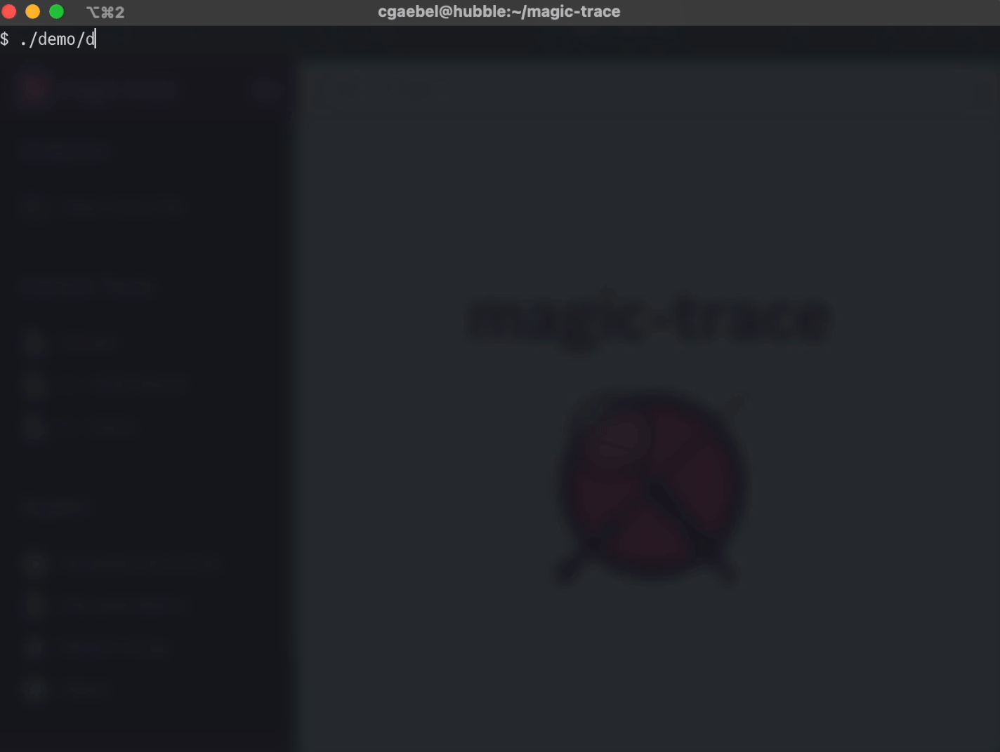

<h1 align="center">
  <picture>
    <source media="(prefers-color-scheme: dark)" srcset="docs/assets/logo-dark.svg?sanitize=true">
    
  </picture>
   
  magic-trace
</h1>

  
  
  

# Overview

magic-trace collects and displays high-resolution traces of what a process is doing. People have used it to:

- figure out why an application running in production handles some requests slowly while simultaneously handling a sea of uninteresting requests,
- look at what their code is *actually* doing instead of what they *think* it's doing,
- get a history of what their application was doing before it crashed, instead of a mere stacktrace at that final instant,
- ...and much more!

magic-trace:

- has [2%-10% overhead](https://github.com/janestreet/magic-trace/wiki/Overhead),
- doesn't require application changes to use,
- traces *every function call* with ~40ns resolution, and
- renders a timeline of call stacks going back (a configurable) ~10ms.

You use it like [`perf`](https://en.wikipedia.org/wiki/Perf_(Linux)): point it to a process and off it goes. The key difference from `perf` is that instead of sampling call stacks throughout time, magic-trace uses [Intel Processor Trace](https://man7.org/linux/man-pages/man1/perf-intel-pt.1.html) to snapshot a ring buffer of *all control flow* leading up to a chosen point in time[^1]. Then, you can explore an interactive timeline of what happened.

You can point magic-trace at a function such that when your application calls it, magic-trace takes a snapshot. Alternatively, attach it to a running process and detach it with <kbd>Ctrl</kbd>+<kbd>C</kbd>, to see a trace of an arbitrary point in your program.

[^1]: `perf` can do this too, but that's not how most people use it. In fact, if you peek under the hood you'll see that magic-trace uses `perf` to drive Intel PT.

# Testimonials

> "Magic-trace is one of the simplest command-line debugging tools I have ever used."
- Francis Ricci, Jane Street

> "Magic-trace is not just for performance. The tool gives insight directly into what happens in your program, when, and why. Consider using it for all your introspective goals!"
- Andrew Hunter, Jane Street

> I use perf a ton, and I think that both perf and magic-trace give perspectives that the other doesn't. The benefit I got from magic-trace was entirely based on the fact that it works in slices at any zoom level, so I was able to see all the function calls that a 70ns function was performing, which was invisible in perf.
- Doug Patti, Jane Street

[more testimonials...](https://github.com/janestreet/magic-trace/wiki/Unsolicited-reviews)

# Install

1. Make sure the system you want to trace is [supported](https://github.com/janestreet/magic-trace/wiki/Supported-platforms,-programming-languages,-and-runtimes). The constraints that most commonly trip people up are: VMs are mostly not supported, Intel only (Skylake[^3] or later), Linux only.

2. Grab a release binary from the [latest release page](https://github.com/janestreet/magic-trace/releases/latest).

   1. If downloading the prebuilt binary (not package), `chmod +x magic-trace`[^4]
   1. If downloading the package, run `sudo dpkg -i magic-trace*.deb`

   Then, test it by running `magic-trace -help`, which should bring up some help text.

[^3]: Strictly speaking, anything newer than Broadwell, but this is not a platform we regularly test on, and timing resolution is worse (~1us).
[^4]: https://github.com/actions/upload-artifact/issues/38

# Getting started

1. [Here](https://raw.githubusercontent.com/janestreet/magic-trace/master/demo/demo.c)'s a sample C program to try out. It's a slightly modified version of the example in `man 3 dlopen`. Download that, build it with `gcc demo.c -ldl -o demo`, then leave it running `./demo`. We're going to use that program to learn how `dlopen` works.

2. Run `magic-trace attach -pid $(pidof demo)`. When you see the message that it's successfully attached, wait a couple seconds and <kbd>Ctrl</kbd>+<kbd>C</kbd> `magic-trace`. It will output a file called `trace.fxt` in your working directory.

  

3. Open [magic-trace.org](https://magic-trace.org/), click _"Open trace file"_ in the top-left-hand and give it the trace file generated in the previous step.

  

4. That should have expanded into a trace. Zoom in until you can see an individual loop through `dlopen`/`dlsym`/`cos`/`printf`/`dlclose`.
    - <kbd>W</kbd> zooms into wherever your mouse cursor is pointed (you'll need to zoom in a bunch to see anything useful),
    - <kbd>S</kbd> zooms out,
    - <kbd>A</kbd> moves left,
    - <kbd>D</kbd> moves right, and
    - scroll wheel moves your viewport up and down the stack. You'll only need to scroll to see particularly deep stack traces, it's probably not useful for this example.

  

5. Click and drag on the white space around the call stacks to measure. Plant flags by clicking in the timeline along the top. Using the measurement tool, measure how long it takes to run `cos`. On my screen it takes ~5.7us.

  

Congratulations, you just magically traced your first program!

In contrast to traditional `perf` workflows, magic-trace excels at hypothesis generation. For example, you might notice that taking 6us to run `cos` is a really long time! If you zoom in even more, you'll see that there's actually five pink "\[untraced\]" cells in there. If you re-run magic-trace with root and pass it `-trace-include-kernel`, you'll see stacktraces for those. They're page fault handlers! The demo program actually calls `cos` twice. If you zoom in even more near the end of the 6us `cos` call, you'll see that the second call takes *far* less time and does not page fault.

# How to use it

magic-trace continuously records control flow into a ring buffer. Upon some sort of trigger, it takes a snapshot of that buffer and reconstructs call stacks.

There are two ways to take a snapshot:

We just did this one: <kbd>Ctrl</kbd>+<kbd>C</kbd> magic-trace. If magic-trace terminates without already having taken a snapshot, it takes a snapshot of the end of the program.

You can also trigger snapshots when the application calls a function. To do so, pass magic-trace
the `-trigger` flag.

- `-trigger '?'` brings up a fuzzy-finding selector that lets you choose from all
  symbols in your executable,
- `-trigger SYMBOL` selects a specific, fully mangled, symbol you know ahead of time, and
- `-trigger .` selects the default symbol `magic_trace_stop_indicator`.

Stop indicators are powerful. Here are some ideas for where you might want to place one:

- If you're using an asynchronous runtime, any time a scheduler cycle takes too long.
- In a server, when a request takes a surprisingly long time.
- After the garbage collector runs, to see what it's doing and what it interrupted.
- After a compiler pass has completed.

You may leave the stop indicator in production code. It doesn't need to do anything in particular, magic-trace just needs the name. It is just an empty, but not inlined, function. It will cost ~10us to call, but *only when magic-trace actually uses it to take a snapshot*.

# Documentation

More documentation is available on [the magic-trace wiki](https://github.com/janestreet/magic-trace/wiki).

# Discussion

Join us [on Discord](https://discord.gg/vkzPYeZ292) to chat synchronously, or the [GitHub discussion group](https://github.com/janestreet/magic-trace/discussions) to do so asynchronously.

# Contributing

If you'd like to contribute:

1. [read the build instructions](https://github.com/janestreet/magic-trace/wiki/Build-instructions),
1. [set up your editor](https://ocaml.org/learn/tutorials/up_and_running.html#Editor-support-for-OCaml),
1. [take a quick tour through the codebase](https://github.com/janestreet/magic-trace/wiki/A-quick-tour-of-the-codebase), then
1. [hit up the issue tracker](https://github.com/janestreet/magic-trace/issues?q=is%3Aissue+is%3Aopen+label%3A%22good+first+issue%22) for a good starter project.

# Privacy policy

magic-trace does not send your code or derivatives of your code (including traces) anywhere.

[magic-trace.org](https://magic-trace.org) is a [lightly modified fork of Perfetto](https://github.com/janestreet/magic-trace/wiki/About-the-UI), and runs entirely in your browser. As far as we can tell, it does not send your trace anywhere. If you're worried about that changing one day, [set up your own local copy of the Perfetto UI](https://github.com/janestreet/magic-trace/wiki/Setting-up-a-local-copy-of-the-UI) and use that instead.

# Acknowledgements

[Tristan Hume](https://github.com/trishume) is the original author of magic-trace. He wrote it while working at [Jane Street](https://www.janestreet.com/join-jane-street/), who currently maintains it.

Intel PT is the foundational technology upon which magic-trace rests. We'd like to thank the people at Intel for their years-long efforts to make it available, despite its slow uptake in the greater software community.

magic-trace would not be possible without `perf`s extensive support for Intel PT. `perf` does most of the work in interpreting Intel PT's output, and magic-trace likely wouldn't exist were it not for their efforts. Thank you, `perf` developers.

[magic-trace.org](https://magic-trace.org) is a fork of [Perfetto](https://github.com/janestreet/magic-trace/wiki/About-the-UI), with minor modifications. We'd like to thank the people at Google responsible for it. It's a high quality codebase that solves a hard problem well.

The ideas behind magic-trace are in no way unique. We've written down a list of [prior art](https://github.com/janestreet/magic-trace/wiki/Prior-art) that has influenced its design.
